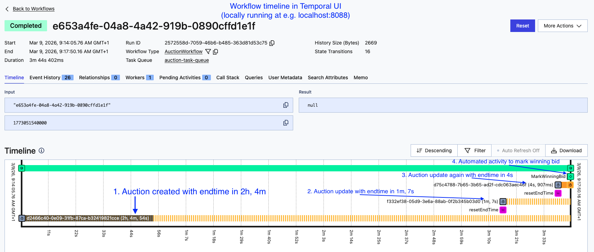

# Simple auction and bidding platform

## Stakeholders:
- Seller: Captures the details of the entity/person selling an item as part of the auction.
- Auction: Captures the details for an auction by a seller for an item.
- Buyer: Captures the details of the buyer who can place bids on an auction.

## Business Process flows:

- Setup: Setup all the stakeholders in the application.
- Bidding: A buyer interested in an auction can bid/quote a price they are willing to pay.
- Auction-closing: An automated system process to pick a winner (if one is available) at the end time of
  an auction as reached.
- Auction-extension: An automated system process to extend the endtime of the auction to prevent
  snipping (last second bids). 

## Workflow actions and validations:

- Only allow a bid if it's higher than the previous bid. If no previous bid, it should be higher
  than the `auction::price`
- Auction is ended via a Temporal workflow with suitable fault-tolerant mechanisms.
- When a bid is won by the buyer at the endtime, it marks the `is_winning_bid` as 'true'
- On a new bid 30s before the auction `endtime`, it should make sure the `additional_buffer_time` is
  incremented by 1 minute.
  This should update the Temporal workflow.

## Auction Workflow Design

### Overview

When an auction is created, a [**Temporal workflow**](https://temporal.io/) is started that owns the
lifecycle of that auction — sleeping until the deadline and then marking the winner. If a late bid
arrives, the workflow is `signaled` to extend its timer. This makes the closing logic fault-tolerant:
Temporal persists workflow state, so a server restart or crash cannot cause an auction to close
without a winner being recorded.

### Flow Diagram

```
POST /auctions
      │
      ▼
AuctionController.kt
      │
      ▼
AuctionApplicationService.kt
      ├── AuctionDomainService.createAuction()   → persists Auction entity
      └── WorkflowClient.start(AuctionWorkflow::execute, auctionId, endTimeEpochMillis)
            │  workflow id = auctionId (UUID)
            ▼
          AuctionWorkflowImpl
                │  sleeps until effectiveEndTime
                │  loops on Workflow.await(remaining) { additionalMinutes increased }
                │  ← extendEndTime() signal (via POST /auctions/{id}/bids when bid within 30 s)
                ▼  deadline reached, no signal
              AuctionActivities.markWinningBid(auctionId)
                  │
                  └── BidRepository.findHighestBid() → sets is_winning_bid = true


POST /auctions/{auctionId}/bids
      │
      ▼
BidController
      │
      ▼
BidApplicationService
      ├── BidDomainService.placeBid()
      │     ├── validates auction not ended
      │     ├── validates price > current highest bid (or auction starting price)
      │     ├── persists Bid
      │     └── returns shouldExtend=true if bid arrived within 30 s of effectiveEndTime
      │           (also increments auction.additionalBufferTime by 1 in DB)
      └── if shouldExtend → workflowStub.extendEndTime()  ← Temporal signal
```

### Temporal rules and logic:

- **Workflow method (@WorkflowMethod)**:

  The entry point / main body of the workflow. It runs as durable, replayable code — Temporal
  records every step so it can replay the execution after a crash. In this codebase it's execute(),
  which owns the auction lifecycle timer loop.

- **Signal (@SignalMethod)**

  An asynchronous message sent to a running workflow from outside. It mutates workflow state without
  waiting for a response. Here, extendEndTime() is called by BidApplicationService when a
  last-second bid arrives — it increments additionalMinutes inside the running workflow, which
  causes the Workflow.await loop to wake up and recalculate the deadline.

- **Activity (@ActivityMethod)**

  A regular, non-replayable unit of work called from within a workflow. Unlike workflow code,
  activities can do I/O (DB calls, HTTP, etc.) and are retried automatically on failure. Here,
  markWinningBid() is the activity — it queries the DB and flips isWinningBid = true. It can't be
  done directly in the workflow method because workflow code must be deterministic and
  side-effect-free.

```
Outside world
│
├─ start ──────────────► @WorkflowMethod  (durable orchestration logic)
│                               │
├─ signal ─────────────► @SignalMethod    (mutate in-flight state)
│                               │
│                               └─ calls ──► @ActivityMethod  (I/O, side effects)
```

The key rule: workflow code must be deterministic (no DB calls, no System.currentTimeMillis(), use
Workflow.currentTimeMillis() instead). Anything with mutation/side effects goes in an activity.

## Architectural rules:

- Follow DDD design pattern. Keep domain as framework independent as possible. It's okay to have
  Spring @Entities though
- Use postgres-sql for database. Have it setup via a `docker-compose.yml` file. Also, Temporal
  server in it.
- Create openapi-spec for the apis
- Expose swagger ui for internal testing
- Package structure:
    - Have all logic in data package.
    - Application package will only orchestrate.
    - Api will have controllers.
    - Config will have application property mapped classes.

## It allows the following apis:

- Allows you to create seller profile. With properties:
    - `id`, `name`
- Allows you to create buyer profile. With properties:
    - `id`, `name`
- Allows you to create simple auction. With properties:
    - `id`, `name`, `seller_id`, `price`, `endtime` (utc zulu), `additional_buffer_time` (in
      minutes)
- Allows you to bid on an auction. With properties:
    - `id`, `auction_id`, `buyer_id`, `price`, `timestamp`, `is_winning_bid` (defaulted to false)
- Fetch the winning bid information given an `auction_id`. With properties:
    - `seller_id`, `name`, `buyer_id`, `initial_price`, `winning_price`, `initial_endtime`,
      `eventual_endtime`

### Key Components

| Layer       | File                                                                                                           | Responsibility                                                          |
|-------------|----------------------------------------------------------------------------------------------------------------|-------------------------------------------------------------------------|
| API         | [`AuctionController.kt`](src/main/kotlin/com/bidding/auction/api/AuctionController.kt)                         | HTTP endpoints for auction create/get                                   |
| API         | [`BidController.kt`](src/main/kotlin/com/bidding/auction/api/BidController.kt)                                 | HTTP endpoints for place bid / winning bid                              |
| Application | [`AuctionApplicationService.kt`](src/main/kotlin/com/bidding/auction/application/AuctionApplicationService.kt) | Orchestrates auction creation and Temporal workflow start               |
| Application | [`BidApplicationService.kt`](src/main/kotlin/com/bidding/auction/application/BidApplicationService.kt)         | Orchestrates bid placement and Temporal signal                          |
| Domain      | [`AuctionDomainService.kt`](src/main/kotlin/com/bidding/auction/data/service/AuctionDomainService.kt)          | Auction persistence logic                                               |
| Domain      | [`BidDomainService.kt`](src/main/kotlin/com/bidding/auction/data/service/BidDomainService.kt)                  | Bid validation, price enforcement, buffer extension logic               |
| Workflow    | [`AuctionWorkflow.kt`](src/main/kotlin/com/bidding/auction/data/workflow/AuctionWorkflow.kt)                   | Temporal workflow interface (`execute`, `extendEndTime` signal)         |
| Workflow    | [`AuctionWorkflowImpl.kt`](src/main/kotlin/com/bidding/auction/data/workflow/AuctionWorkflowImpl.kt)           | Durable sleep loop; extends deadline on signal; calls activity at close |
| Activity    | [`AuctionActivities.kt`](src/main/kotlin/com/bidding/auction/data/workflow/AuctionActivities.kt)               | Activity interface (`markWinningBid`)                                   |
| Activity    | [`AuctionActivitiesImpl.kt`](src/main/kotlin/com/bidding/auction/data/workflow/AuctionActivitiesImpl.kt)       | Queries highest bid and flags it as winner                              |
| Config      | [`TemporalConfig.kt`](src/main/kotlin/com/bidding/auction/config/TemporalConfig.kt)                            | Wires `WorkflowClient`, worker, registers workflow/activity             |

### Deadline Extension Rules

- Effective end time = `endTime + (additionalBufferTime × 60 s)`
- A bid placed within the **last 30 seconds** of the effective end time:
  1. increments `auction.additionalBufferTime` by 1 in the DB ([`BidDomainService`](src/main/kotlin/com/bidding/auction/data/service/BidDomainService.kt):48–51)
  2. sends an `extendEndTime` signal to the running Temporal workflow ([`BidApplicationService`](src/main/kotlin/com/bidding/auction/application/BidApplicationService.kt):31–34)
- The workflow's `await` loop wakes on the signal, recalculates `effectiveEndTime`, and resumes sleeping for the new remaining duration ([`AuctionWorkflowImpl`](src/main/kotlin/com/bidding/auction/data/workflow/AuctionWorkflowImpl.kt):22–36)

### Winner Determination

Once the deadline passes with no extension signal, the workflow calls `markWinningBid(auctionId)`. The activity [`AuctionActivitiesImpl`](src/main/kotlin/com/bidding/auction/data/workflow/AuctionActivitiesImpl.kt) finds the highest-priced bid via `BidRepository.findHighestBid` and sets `is_winning_bid = true`. The result is then queryable via `GET /auctions/{auctionId}/winning-bid`.

---

## Verification
1. docker compose up -d --> Postgres + Temporal running
2. `./gradlew bootRun` --> app starts, JPA creates schema
3. Swagger UI at http://localhost:8080/swagger-ui.html
4. Flow: create seller -> create buyer -> create auction (workflow starts in Temporal UI at :8088) ->
   place bids -> check winning bid after endTime

---

## Temporal workflow UI
You can access Temporal's workflow UI running at: http://localhost:8088.

The screenshot shows a clear workflow in action.
